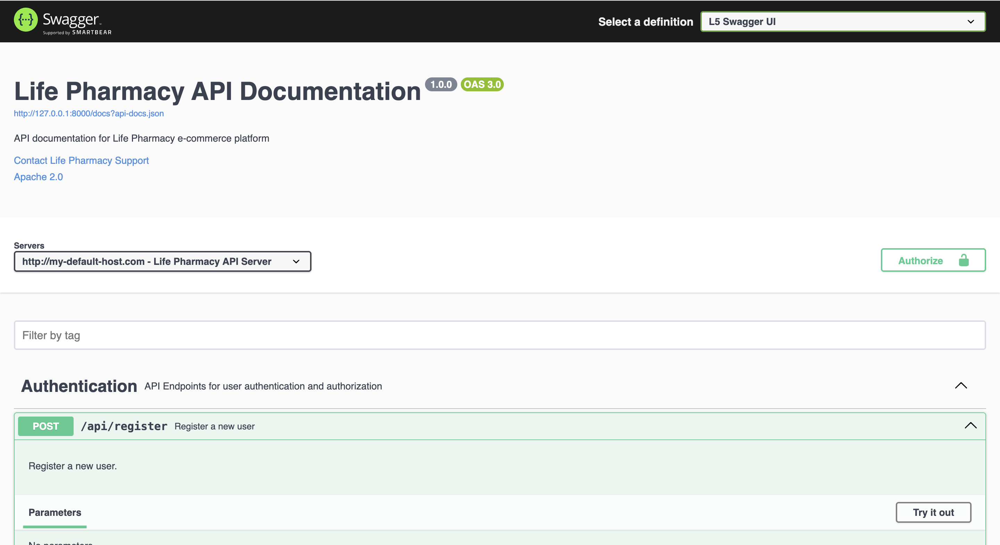
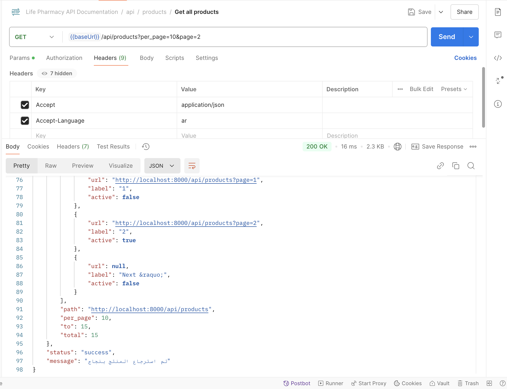
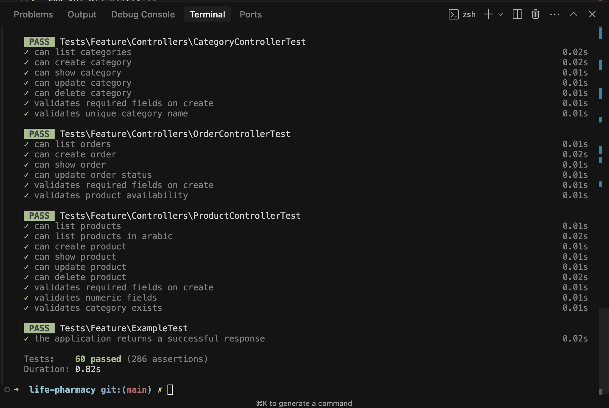

# Life Pharmacy API

A robust RESTful API for managing a pharmacy's product catalog, built with Laravel.

## Features

- RESTful API endpoints for product management
- Docker containerization for easy deployment
- Redis caching for improved performance
- MySQL database for data storage
- Nginx web server
- API rate limiting
- Input sanitization
- Comprehensive error handling
- PHPDoc documentation
- Multi-language support (English and Arabic)
- Comprehensive test suite with high coverage
- Localized middleware messages

## Screenshots

### API Documentation

*Swagger UI documentation for the API endpoints*

### API Response Examples

*Example of API response with localized messages*

### Docker Services

*Running Docker services for the application*

### Test Coverage

*Test coverage report showing comprehensive testing*

## Prerequisites

- Docker
- Docker Compose
- Git

## Docker Setup

1. Clone the repository:
```bash
git clone https://github.com/yourusername/life-pharmacy.git
cd life-pharmacy
```

2. Copy the environment file:
```bash
cp .env.example .env
```

3. Update the `.env` file with your database credentials:
```env
DB_CONNECTION=mysql
DB_HOST=db
DB_PORT=3306
DB_DATABASE=life_pharmacy
DB_USERNAME=your_username
DB_PASSWORD=your_password

CACHE_DRIVER=redis
REDIS_HOST=redis
REDIS_PASSWORD=null
REDIS_PORT=6379
```

4. Build and start the Docker containers:
```bash
docker-compose up -d
```

5. Install PHP dependencies:
```bash
docker-compose exec app composer install
```

6. Generate application key:
```bash
docker-compose exec app php artisan key:generate
```

7. Run database migrations:
```bash
docker-compose exec app php artisan migrate
```

8. Set proper permissions:
```bash
docker-compose exec app chown -R www-data:www-data storage bootstrap/cache
```

## Docker Services

The application uses the following Docker services:

- **app**: PHP-FPM 8.2 application container
- **nginx**: Nginx web server
- **db**: MySQL 8.0 database
- **redis**: Redis cache server

## Accessing the Application

- API: http://localhost:8000/api
- Database: localhost:3306
- Redis: localhost:6379

## API Endpoints

### Products

- `GET /api/products` - List all products
- `POST /api/products` - Create a new product
- `GET /api/products/{id}` - Get a specific product
- `PUT /api/products/{id}` - Update a product
- `DELETE /api/products/{id}` - Delete a product

## Language Support

The API supports multiple languages through the `Accept-Language` header:

- English (default): `Accept-Language: en`
- Arabic: `Accept-Language: ar`

If no language header is provided or an unsupported language is specified, the API will default to English.

Example:
```bash
# English response
curl -H "Accept-Language: en" http://localhost:8000/api/products

# Arabic response
curl -H "Accept-Language: ar" http://localhost:8000/api/products
```

### Localized Messages

The application provides localized messages for:
- API responses
- Validation errors
- Middleware messages
- Error messages

All messages are available in both English and Arabic, and will be returned based on the `Accept-Language` header.

## Testing

The application includes a comprehensive test suite with high coverage. Tests are organized into:

### Unit Tests
- `tests/Unit/Services/ProductServiceTest.php` - Tests product service logic
- `tests/Unit/Middleware/SetLocaleTest.php` - Tests language switching
- `tests/Unit/Traits/ApiResponseTest.php` - Tests API response formatting
- `tests/Unit/Traits/SanitizesInputTest.php` - Tests input sanitization

### Feature Tests
- `tests/Feature/Controllers/ProductControllerTest.php` - Tests API endpoints

### Running Tests

1. Run all tests:
```bash
docker-compose exec app php artisan test
```

2. Run specific test file:
```bash
docker-compose exec app php artisan test tests/Unit/Services/ProductServiceTest.php
```

3. Run tests with coverage report:
```bash
docker-compose exec app php artisan test --coverage
```

### Test Coverage

The test suite provides comprehensive coverage for:
- All API endpoints
- Business logic in services
- Middleware functionality
- Input validation and sanitization
- Language switching
- Response formatting
- Database operations

### Test Categories

1. **Service Tests**
   - CRUD operations
   - Business logic
   - Data manipulation
   - Cache handling

2. **Controller Tests**
   - API endpoint functionality
   - Request validation
   - Response formatting
   - Error handling

3. **Middleware Tests**
   - Language switching
   - Request processing
   - Header handling

4. **Trait Tests**
   - API response formatting
   - Input sanitization
   - Helper methods

## Caching

The application uses Redis for caching:
- Product listings are cached for 1 hour
- Individual products are cached for 1 hour
- Cache is automatically cleared when products are updated or deleted

## Development

1. Start the development environment:
```bash
docker-compose up -d
```

2. View logs:
```bash
docker-compose logs -f
```

3. Stop the environment:
```bash
docker-compose down
```

This project is licensed under the MIT License - see the [LICENSE](LICENSE) file for details.
