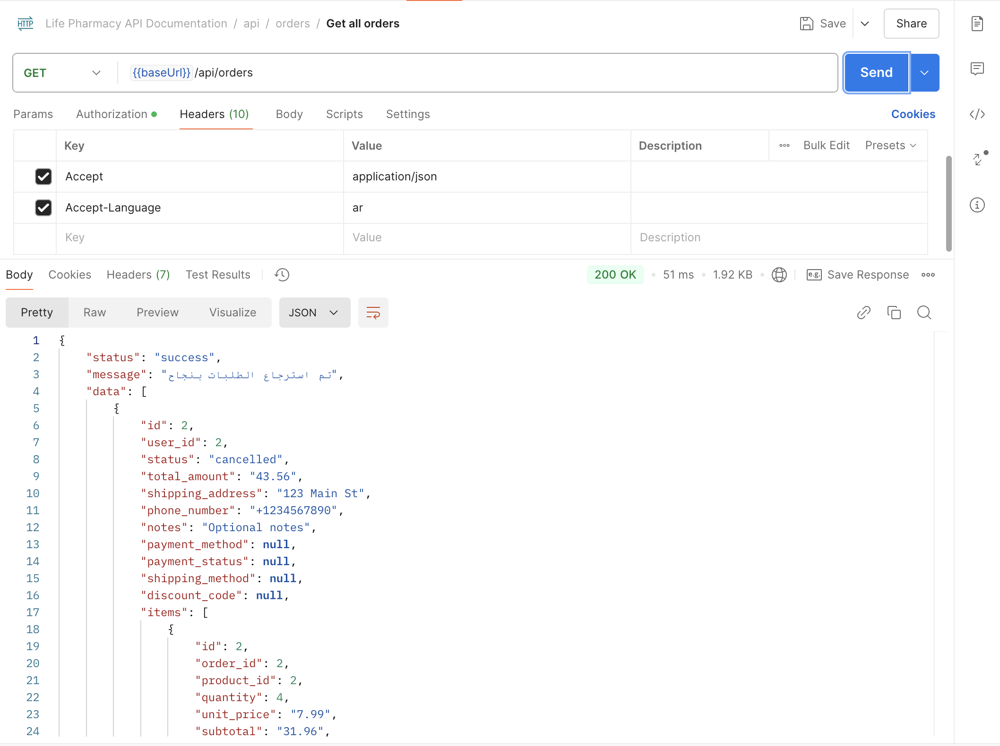

# Life Pharmacy API

A robust RESTful API for managing a pharmacy's product catalog, built with Laravel.

## Features

- RESTful API endpoints for product management
- Redis caching for improved performance
- MySQL database for data storage
- Nginx web server
- API rate limiting
- Input sanitization
- Comprehensive error handling
- PHPDoc documentation
- Multi-language support (English and Arabic)
- Comprehensive test suite with high coverage
- Localized middleware messages

## Screenshots

### API Documentation

*[Swagger UI documentation](http://127.0.0.1:8000/api/documentation) for the API endpoints*

### API Response Examples

*Example of API response with localized messages*


*Example of API  response with localized messages*

### Test Coverage

*Test coverage report showing comprehensive testing*

## Setup Instructions

Choose your preferred setup method:

- [Docker Setup](docs/docker-setup.md) - Recommended for easy deployment
- [Local Setup](docs/local-setup.md) - For development without Docker

## API Endpoints

### Products

- `GET /api/products` - List all products
- `POST /api/products` - Create a new product
- `GET /api/products/{id}` - Get a specific product
- `PUT /api/products/{id}` - Update a product
- `DELETE /api/products/{id}` - Delete a product

## Language Support

The API supports multiple languages through the `Accept-Language` header:

- English (default): `Accept-Language: en`
- Arabic: `Accept-Language: ar`

If no language header is provided or an unsupported language is specified, the API will default to English.

Example:
```bash
# English response
curl -H "Accept-Language: en" http://localhost:8000/api/products

# Arabic response
curl -H "Accept-Language: ar" http://localhost:8000/api/products
```

## Testing

The application includes a comprehensive test suite with high coverage. Tests are organized into:

### Unit Tests
- `tests/Unit/Services/ProductServiceTest.php` - Tests product service logic
- `tests/Unit/Middleware/SetLocaleTest.php` - Tests language switching
- `tests/Unit/Traits/ApiResponseTest.php` - Tests API response formatting
- `tests/Unit/Traits/SanitizesInputTest.php` - Tests input sanitization

### Feature Tests
- `tests/Feature/Controllers/ProductControllerTest.php` - Tests API endpoints

For detailed testing instructions, please refer to the setup documentation:
- [Docker Testing](docs/docker-setup.md#testing)
- [Local Testing](docs/local-setup.md#testing)

## Caching

The application uses Redis for caching:
- Product listings are cached for 1 hour
- Individual products are cached for 1 hour
- Cache is automatically cleared when products are updated or deleted

This project is licensed under the MIT License - see the [LICENSE](LICENSE) file for details.
